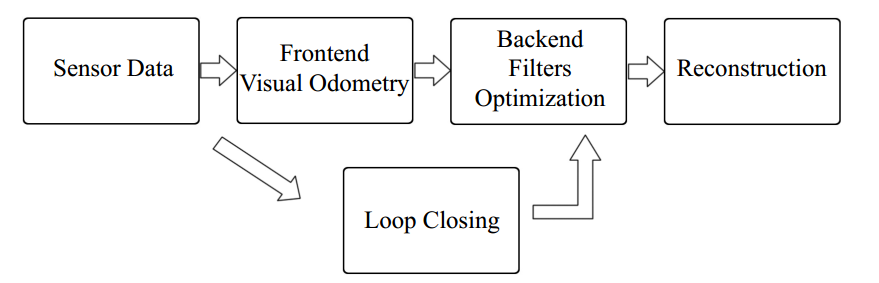

# Chapter 2. First Glance of Visual SLAM

## 1. What is Visual SLAM?

Using cameras to solve the localization and mapping problems.

## 2. Classic Visual SLAM Framework

A typical visual SLAM work-flow includes the following steps:

### 2.1 Sensor data acquisition

Acquisition and preprocessing for camera images.  For mobile robot, this will also include the acquisition and synchronization with motor encoders, IMU sensors, etc.

### 2.2 Visual Odometry (VO) (Front End)

Estimate the camera movement between adjacent frames (ego-motion), as well as to generate a rough local map.

### 2.3 Back End Filters / Optimization

The back end receives camera poses at different time stamps from VO, as well as results from loop closing, and apply optimization to generate a fully optimized trajectory and map.

### 2.4 Loop Closing

Determine whether the robot has returned to its previous position in order tor reduce the accumulated drift.  If a loop is detected, it will provide information to the back end for further optimization.

### 2.5 Reconstruction

Construct a task specific map based on the estimated camera trajectory.

## 3. Mathematical Formulation of SLAM Problems

### 3.1 Motion Equation

$$
x_k = f(x_{k-1}, u_k, w_k)
$$

where $$u_k$$ is the input orders, and $$w_k$$ is noise.

### 3.2 Observation Equation

$$
z_{k, j} = h(y_j, x_k, v_{k,j})
$$

where $$y_j$$ is the landmark, $$x_k$$ is the robot's position, $$v_{k,j}$$ is the observation noise.